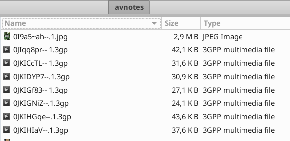

# OsmAnd A/V Notes to JOSM converter
When you have recorded pictures and sounds from OsmAnd, see [audio-video-notes-plugin](https://osmand.net/features/audio-video-notes-plugin), you will get a folder similar to this example:

Copy the file setGPSPos.py in this folder and execute it with python 3.

This will generate a file called avnotes.gpx which can be imported by [josm](https://josm.openstreetmap.de/)

